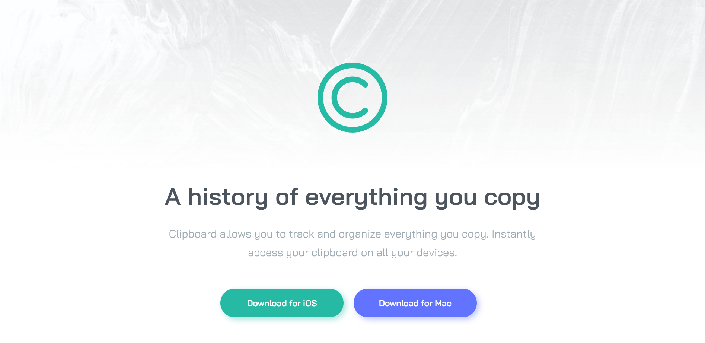

# Frontend Mentor - Clipboard landing page solution

This is a solution to the [Clipboard landing page challenge on Frontend Mentor](https://www.frontendmentor.io/challenges/clipboard-landing-page-5cc9bccd6c4c91111378ecb9). Frontend Mentor challenges help you improve your coding skills by building realistic projects. 

Users should be able to:

- View the optimal layout for the site depending on their device's screen size
- See hover states for all interactive elements on the page

- [Solution](https://www.frontendmentor.io/solutions/clipboard-landing-page---html-css-It8Eqmeq_I)
- [Live Site](https://lspacka.github.io/FEM-clipboard-landing-page/)

### Built with

- HTML
- CSS

### Author

- [Frontend Mentor](https://www.frontendmentor.io/profile/lspacka)
- [Twatter](https://x.com/lspacka)